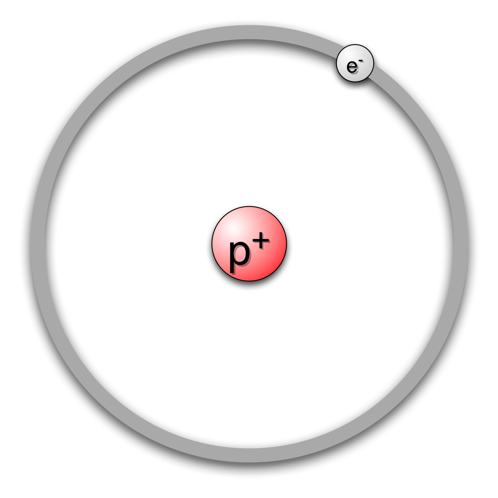
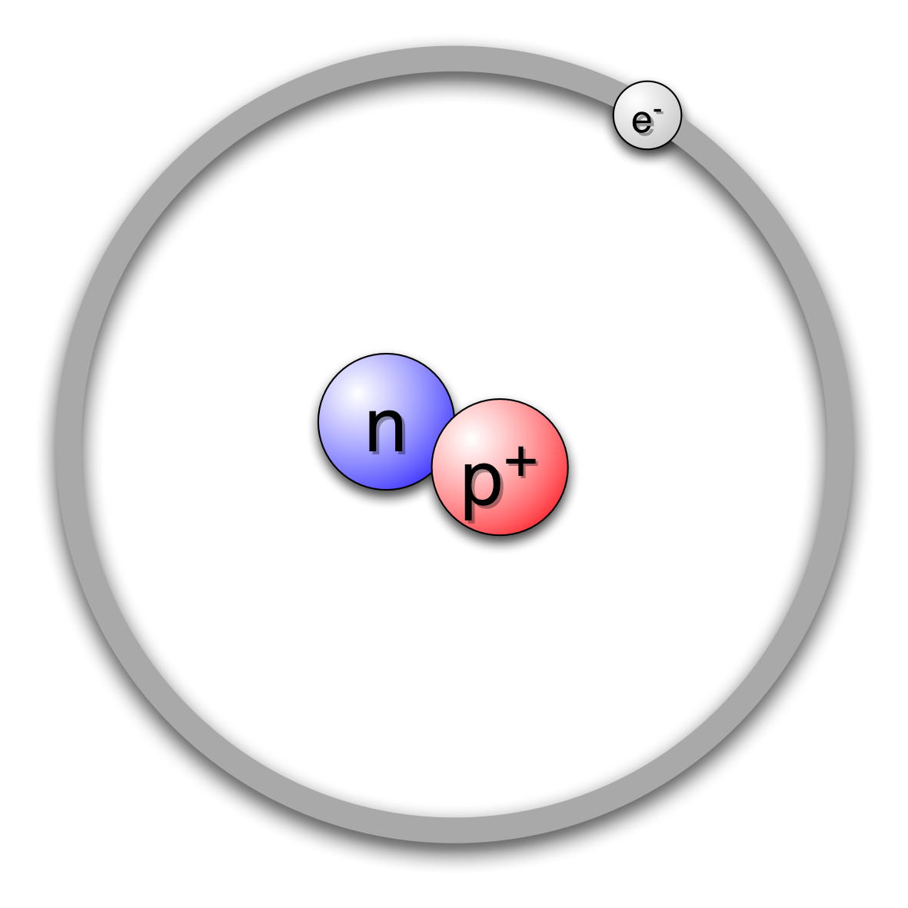

Atomer
======

For å forstå hvordan stoffer reagerer med hverandre, og hvorfor de ulike stoffene har forskjellige egenskaper, må vi først lære om de minste byggesteinene i naturen, nemlig atomer.

Atomets oppbygging
------------------
Når vi skal lære hvordan et atom er bygget opp, er det ikke så viktig å forsøke å forstå hvordan det egentlig ser ut. Når vi skal beskrive oppbyggingen, er vi mer interessert i å forstå hvordan atomene virker på hverandre.

> Atomer er satt sammen av byggesteinene protoner, nøytroner og elektroner.

De to første typene, protoner og nøytroner, kaller vi kjernepartikler. Det er fordi disse alltid er plassert i kjernen til atomet. Vi tenker oss at den siste byggesteinen, elektronet, beveger seg i ulike skall rundt kjernen.

Hydrogen
--------
La oss først ta for oss det enkleste atomet vi kan tenke oss: et atom med bare ett proton og ett elektron. Atomer som er satt sammen slik, kaller vi hydrogen.

Hydrogen består altså av en kjerne med ett proton og ett elektron som befinner seg i skallet rundt kjernen. Disse partiklene har også en ladning, omtrent som pluss og minus på et batteri. Protoner har en positiv ladning, og elektroner har en like stor negativ ladning. Til sammen utligner de hverandre slik at summen av ladninger i atomet er null.

Men hva med den siste byggesteinen, nøytronet? Som navnet antyder, har ikke denne partikkelen noen ladning (den er nøytral). Det er som regel omtrent like mange nøytroner som protoner i et atom. Hydrogenatomet finnes i tre varianter: én variant som ikke har noe nøytron, én som har ett nøytron, og én som har to nøytroner. Slike varianter av samme atom kaller vi isotoper.

---

 Dette verk av <a xmlns:cc="http://creativecommons.org/ns#" href="http://runemathisen.com/" property="cc:attributionName" rel="cc:attributionURL">Rune Mathisen</a> er lisensieret under en <a rel="license" href="http://creativecommons.org/licenses/by-sa/4.0/">Creative CommonsNavngivelse-DelPåSammeVilkår 4.0 Internasjonal lisens</a>. Basert på et verk på adresse <a xmlns:dct="http://purl.org/dc/terms/" href="https://github.com/fagstoff/kjemiprosess" rel="dct:source">https://github.com/fagstoff/kjemiprosess</a>.