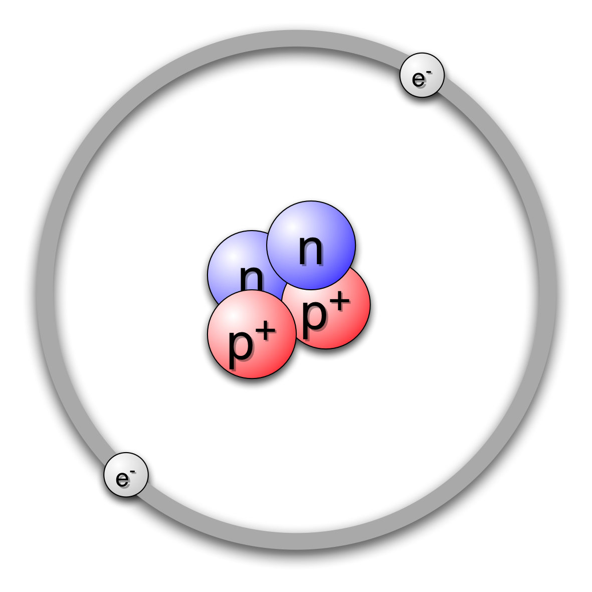
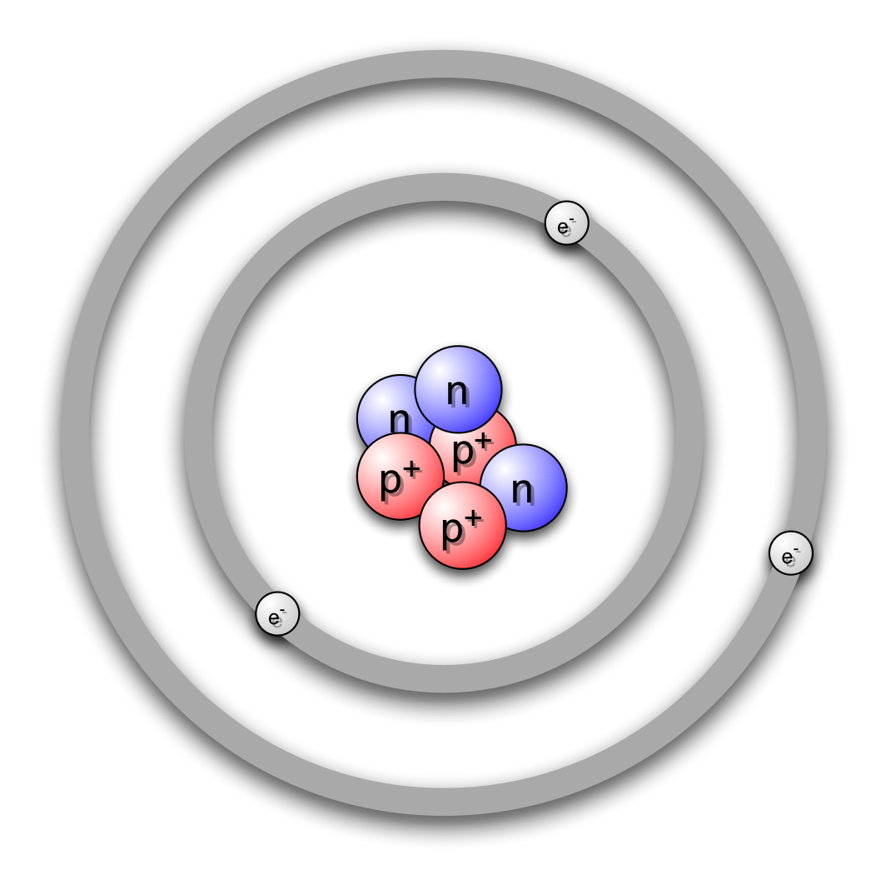

Grunnstoffer
============
Du har helt sikkert hørt om grunnstoffer før, men hvordan definerer vi egentlig hva et grunnstoff er?

> Et grunnstoff består kun av atomer med samme antall protoner i kjernen.

Det betyr at grunnstoffet hydrogen bare kan ha ett proton i kjernen. Hvis det er to eller flere protoner i kjernen, er det ikke lenger hydrogen. Da er det et annet grunnstoff!

I gamle dager fantes det mennesker som ble kalt alkymister. De forsøkte å gjøre grunnstoffet bly om til grunnstoffet gull. Det klarte de aldri.

> Et grunnstoff kan ikke endres til å bli et annet grunnstoff gjennom kjemiske prosesser.

Selv om vi ikke kan forandre et grunnstoff til å bli et annet grunnstoff gjennom kjemiske prosesser, kan vi få det til ved hjelp av noe som kalles kjernereaksjoner. Men her skal vi konsentrere oss om kjemiske reaksjoner, og da er det altså ikke mulig å gjøre bly om til gull.

La oss ta for oss grunnstoffet hydrogen igjen, men nå legger vi til ett proton. Da vet du at det ikke er grunnstoffet hydrogen lenger, fordi hydrogen bare kan ha ett proton i kjernen. Hvis vi har to protoner i kjernen, har vi med grunnstoffet helium å gjøre.

For at summen av ladninger i atomet nå skal bli null, må vi i tillegg til å ha et ekstra proton også ha et ekstra elektron. Da har vi to plussladninger og to minusladninger. Det er også nøytroner i kjernen til helium. På samme måten som for hydrogen finnes det også ulike isotoper av helium. De vanligste isotopene av helium har enten ett eller to nøytroner.

> Isotoper er varianter av samme grunnstoff, men der antallet nøytroner i kjernen er forskjellig.

Legger vi til enda ett proton, får vi grunnstoffet litium. Siden litium har tre protoner, trenger vi tre elektroner. Men nå oppstår det et lite problem: Det er nemlig bare plass til to elektroner i det skallet som er nærmest atomkjernen!

For å løse dette problemet lager vi et nytt skall som ligger litt lenger unna atomkjernen. I dette nye skallet er det plass til opptil åtte elektroner. Litium bruker bare én av disse plassene, men det er viktig å vite at det er plass til totalt åtte elektroner i dette skallet.

> I det innerste elektronskallet er det plass til to elektroner, og i det neste elektronskallet er det plass til åtte elektroner.

Alle grunnstoffer har et atomnummer, og dette nummeret er det samme som antallet protoner i kjernen. Dermed får hydrogen atomnummer 1, mens helium har atomnummer 2. Og da har du sikkert allerede gjettet at litium har atomnummer 3.

> Atomnummeret til et grunnstoff er identisk med antall protoner i atomkjernen.

Grunnstoffet som har 92 protoner i kjernen, kalles uran. Dette er det tyngste grunnstoffet som finnes i naturen. I tillegg finnes det grunnstoffer med flere enn 92 protoner, men disse er kunstig laget.

---

 Dette verk av <a xmlns:cc="http://creativecommons.org/ns#" href="http://runemathisen.com/" property="cc:attributionName" rel="cc:attributionURL">Rune Mathisen</a> er lisensieret under en <a rel="license" href="http://creativecommons.org/licenses/by-sa/4.0/">Creative CommonsNavngivelse-DelPåSammeVilkår 4.0 Internasjonal lisens</a>. Basert på et verk på adresse <a xmlns:dct="http://purl.org/dc/terms/" href="https://github.com/fagstoff/kjemiprosess" rel="dct:source">https://github.com/fagstoff/kjemiprosess</a>.